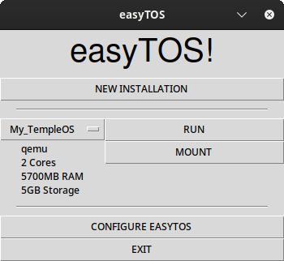

# easyTOS!
easyTOS is a utility program for installing, running, and mounting TempleOS. Please note that this software is in the alpha stage of development, so bugs might occur.



## Prerequisites
 - Linux: easyTOS currently only works on Linux.
 - Python 3.11
 - Tkinter
 - Requests
 - QEMU

## Installing
```bash
$ git clone https://github.com/berserkware/easytos
$ cd easytos
$ sudo cp easytos.py /usr/bin/easytos
```

## Running/Using
You need to run easyTOS with sudo for it to work.
```bash
$ sudo easytos
```
### Options
 - NEW INSTALLATION: Downloads the TOS ISO, creates the QEMU disc, and runs the VM for you to install TOS on the disc.
 - Installation Selector: Selection installation
 - RUN: Runs the selected installtion.
 - MOUNT: Mounts the selected installation's QEMU disc to allow you transfer files between your computer and Linux.
 - UNMOUNT: Unmounts the installation's QEMU disc.
 - EXIT: Exits easyTOS.

## Configuring
You can configure the VMs and easyTOS by editing the /var/lib/easytos/config.ini file.

## TODO
 - [DONE] Support for mulitple TOS VMs
 - [DONE] Graphical VM-configurator
 - Graphical easyTOS-configurator
 - Support mounting other drives, like the D drive.
 - Terminal logging.
